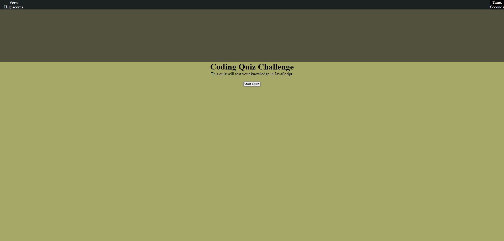
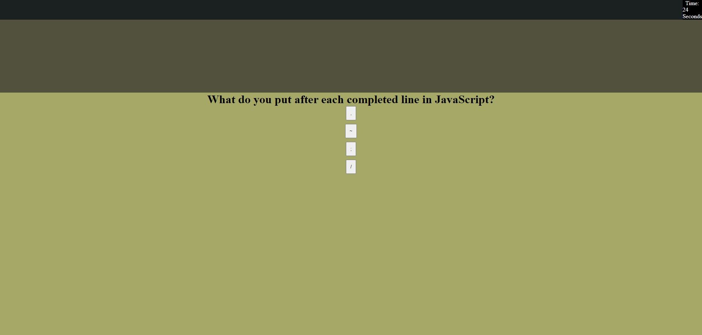
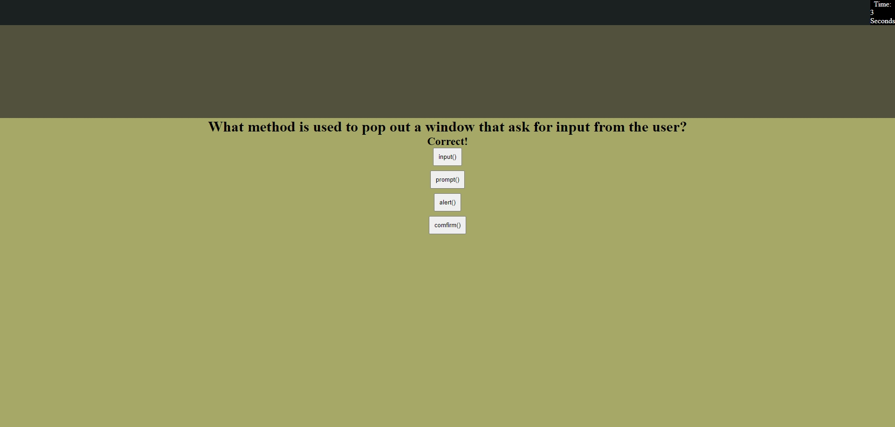
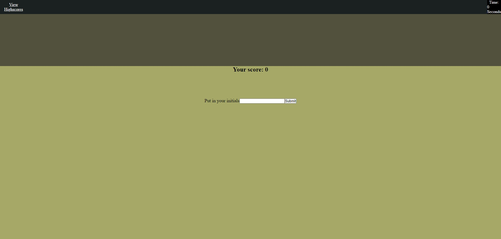
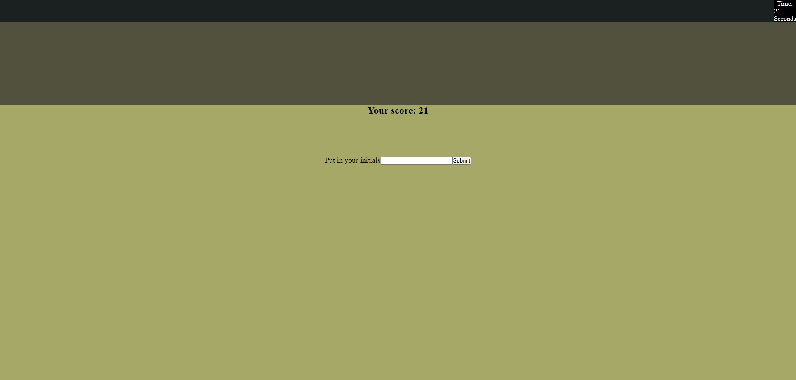

# Coding Quiz

## Description

My motivation was to create a quiz for anyone to test their knowledge on JavaScript. They can then record their high scores. 

I build this project because I want to help others to learn more about JavaScript and to deepen their knowledge in it.

The problem that is solved is that it helped others to understand JavaScript.

I learned that Flexbox is useful in certain situations and using mulitple functions can make things easier.

## Table of Contents (Optional)

If your README is long, add a table of contents to make it easy for users to find what they need.

- [Installation](#installation)
- [Usage](#usage)
- [Credits](#credits)
- [License](#license)
- [Badges](#badges)
- [Features](#features)
- [HowToContribute](#how-to-contribute)
- [Tests](#tests)

## Installation

To install the project:

1. Click on the GitHub Repo to download.
2. Download the zip folder.
3. Open the index file through a browser.

## Usage

Starting Page where the quiz will start

After landing on the first question

When choice chosen is correct

When the score is zero

When getting the high score

## Credits

Collaborators include:

1. Sichoun Nphlaib Lee: https://github.com/DDXP3
2. Joey Thao: https://github.com/Thaodev23

Both students brainstorm with me and dicuss the process to start the deveopment of the coding quiz. I learned more about other aspects of the assignments.

Sources:

1. https://www.w3schools.com/jsref/met_element_remove.asp
2. https://developer.mozilla.org/en-US/docs/Web/API/Window/prompt
3. https://developer.mozilla.org/en-US/docs/Web/JavaScript/Reference/Global_Objects/eval
4. https://www.w3schools.com/js/js_arrays.asp
5. https://coolors.co/1b2021-51513d-a6a867-e3dc95-e3dcc2

## License

There is no license.

## Badges

There are no badges.

## Features

The features show:

1. Timer countdowns to 0 and quiz is over.
2. Score is depend on how fast the correct answer is chosen.
3. Game is over when 0 is reached or last question is over.

## How to Contribute

There is a need to improve for the visual and more questions to be created.

## Tests

There would be test where score should be shown more.